# Projects and dependencies analysis

This document provides a comprehensive overview of the projects and their dependencies in the context of upgrading to .NETCoreApp,Version=v10.0.

## Table of Contents

- [Executive Summary](#executive-Summary)
  - [Highlevel Metrics](#highlevel-metrics)
  - [Projects Compatibility](#projects-compatibility)
  - [Package Compatibility](#package-compatibility)
  - [API Compatibility](#api-compatibility)
  - [Binding Redirect Configuration](#binding-redirect-configuration)
- [Aggregate NuGet packages details](#aggregate-nuget-packages-details)
- [Top API Migration Challenges](#top-api-migration-challenges)
  - [Technologies and Features](#technologies-and-features)
  - [Most Frequent API Issues](#most-frequent-api-issues)
- [Projects Relationship Graph](#projects-relationship-graph)
- [Project Details](#project-details)

  - [Batec.Azure.Data.Extensions.Common\src\Batec.Azure.Data.Extensions.Common.csproj](#batecazuredataextensionscommonsrcbatecazuredataextensionscommoncsproj)
  - [Batec.Azure.Data.Extensions.Common\tests\Batec.Azure.Data.Extensions.Common.Tests.csproj](#batecazuredataextensionscommontestsbatecazuredataextensionscommontestscsproj)
  - [Batec.Azure.Data.Extensions.MySqlConnector\src\Batec.Azure.Data.Extensions.MySqlConnector.csproj](#batecazuredataextensionsmysqlconnectorsrcbatecazuredataextensionsmysqlconnectorcsproj)
  - [Batec.Azure.Data.Extensions.MySqlConnector\tests\Batec.Azure.Data.Extensions.MySqlConnector.Tests.csproj](#batecazuredataextensionsmysqlconnectortestsbatecazuredataextensionsmysqlconnectortestscsproj)
  - [Batec.Azure.Data.Extensions.Npgsql.EntityFrameworkCore\src\Batec.Azure.Data.Extensions.Npgsql.EntityFrameworkCore.csproj](#batecazuredataextensionsnpgsqlentityframeworkcoresrcbatecazuredataextensionsnpgsqlentityframeworkcorecsproj)
  - [Batec.Azure.Data.Extensions.Npgsql.EntityFrameworkCore\tests\Batec.Azure.Data.Extensions.Npgsql.EntityFrameworkCore.Tests.csproj](#batecazuredataextensionsnpgsqlentityframeworkcoretestsbatecazuredataextensionsnpgsqlentityframeworkcoretestscsproj)
  - [Batec.Azure.Data.Extensions.Npgsql\src\Batec.Azure.Data.Extensions.Npgsql.csproj](#batecazuredataextensionsnpgsqlsrcbatecazuredataextensionsnpgsqlcsproj)
  - [Batec.Azure.Data.Extensions.Npgsql\tests\Batec.Azure.Data.Extensions.Npgsql.Tests.csproj](#batecazuredataextensionsnpgsqltestsbatecazuredataextensionsnpgsqltestscsproj)
  - [Batec.Azure.Data.Extensions.Pomelo.EntityFrameworkCore\src\Batec.Azure.Data.Extensions.Pomelo.EntityFrameworkCore.csproj](#batecazuredataextensionspomeloentityframeworkcoresrcbatecazuredataextensionspomeloentityframeworkcorecsproj)
  - [Batec.Azure.Data.Extensions.Pomelo.EntityFrameworkCore\tests\Batec.Azure.Data.Extensions.Pomelo.EntityFrameworkCore.Tests.csproj](#batecazuredataextensionspomeloentityframeworkcoretestsbatecazuredataextensionspomeloentityframeworkcoretestscsproj)
  - [Batec.Core.TestFramework\Batec.Core.TestFramework.csproj](#bateccoretestframeworkbateccoretestframeworkcsproj)
  - [Sample.Repository.Tests\Sample.Repository.Tests.csproj](#samplerepositorytestssamplerepositorytestscsproj)
  - [Sample.Repository\Sample.Repository.csproj](#samplerepositorysamplerepositorycsproj)

## Executive Summary

### Highlevel Metrics

| Metric | Count | Status |
| :--- | :---: | :--- |
| Total Projects | 13 | All require upgrade |
| Total NuGet Packages | 66 | 7 need upgrade |
| Total Code Files | 36 |  |
| Total Code Files with Incidents | 15 |  |
| Total Lines of Code | 1653 |  |
| Total Number of Issues | 40 |  |
| Estimated LOC to modify | 4+ | at least 0,2% of codebase |

### Projects Compatibility

| Project | Target Framework | Difficulty | Package Issues | API Issues | Binding Issues | Est. LOC Impact | Description |
| :--- | :---: | :---: | :---: | :---: | :---: | :---: | :--- |
| [Batec.Azure.Data.Extensions.Common\src\Batec.Azure.Data.Extensions.Common.csproj](#batecazuredataextensionscommonsrcbatecazuredataextensionscommoncsproj) | net462;netstandard2.0 | 🟢 Low | 0 | 0 | 0 |  | ClassLibrary, Sdk Style = True |
| [Batec.Azure.Data.Extensions.Common\tests\Batec.Azure.Data.Extensions.Common.Tests.csproj](#batecazuredataextensionscommontestsbatecazuredataextensionscommontestscsproj) | net7.0;net6.0 | 🟢 Low | 2 | 0 | 0 |  | ClassLibrary, Sdk Style = True |
| [Batec.Azure.Data.Extensions.MySqlConnector\src\Batec.Azure.Data.Extensions.MySqlConnector.csproj](#batecazuredataextensionsmysqlconnectorsrcbatecazuredataextensionsmysqlconnectorcsproj) | net462;netstandard2.0 | 🟢 Low | 0 | 0 | 0 |  | ClassLibrary, Sdk Style = True |
| [Batec.Azure.Data.Extensions.MySqlConnector\tests\Batec.Azure.Data.Extensions.MySqlConnector.Tests.csproj](#batecazuredataextensionsmysqlconnectortestsbatecazuredataextensionsmysqlconnectortestscsproj) | net7.0;net6.0 | 🟢 Low | 2 | 0 | 0 |  | ClassLibrary, Sdk Style = True |
| [Batec.Azure.Data.Extensions.Npgsql.EntityFrameworkCore\src\Batec.Azure.Data.Extensions.Npgsql.EntityFrameworkCore.csproj](#batecazuredataextensionsnpgsqlentityframeworkcoresrcbatecazuredataextensionsnpgsqlentityframeworkcorecsproj) | net6.0;net7.0 | 🟢 Low | 0 | 0 | 0 |  | ClassLibrary, Sdk Style = True |
| [Batec.Azure.Data.Extensions.Npgsql.EntityFrameworkCore\tests\Batec.Azure.Data.Extensions.Npgsql.EntityFrameworkCore.Tests.csproj](#batecazuredataextensionsnpgsqlentityframeworkcoretestsbatecazuredataextensionsnpgsqlentityframeworkcoretestscsproj) | net7.0;net6.0 | 🟢 Low | 6 | 0 | 0 |  | ClassLibrary, Sdk Style = True |
| [Batec.Azure.Data.Extensions.Npgsql\src\Batec.Azure.Data.Extensions.Npgsql.csproj](#batecazuredataextensionsnpgsqlsrcbatecazuredataextensionsnpgsqlcsproj) | net462;netstandard2.0 | 🟢 Low | 1 | 2 | 0 | 2+ | ClassLibrary, Sdk Style = True |
| [Batec.Azure.Data.Extensions.Npgsql\tests\Batec.Azure.Data.Extensions.Npgsql.Tests.csproj](#batecazuredataextensionsnpgsqltestsbatecazuredataextensionsnpgsqltestscsproj) | net7.0;net6.0 | 🟢 Low | 2 | 2 | 0 | 2+ | ClassLibrary, Sdk Style = True |
| [Batec.Azure.Data.Extensions.Pomelo.EntityFrameworkCore\src\Batec.Azure.Data.Extensions.Pomelo.EntityFrameworkCore.csproj](#batecazuredataextensionspomeloentityframeworkcoresrcbatecazuredataextensionspomeloentityframeworkcorecsproj) | net6.0;net7.0 | 🟢 Low | 0 | 0 | 0 |  | ClassLibrary, Sdk Style = True |
| [Batec.Azure.Data.Extensions.Pomelo.EntityFrameworkCore\tests\Batec.Azure.Data.Extensions.Pomelo.EntityFrameworkCore.Tests.csproj](#batecazuredataextensionspomeloentityframeworkcoretestsbatecazuredataextensionspomeloentityframeworkcoretestscsproj) | net7.0;net6.0 | 🟢 Low | 6 | 0 | 0 |  | ClassLibrary, Sdk Style = True |
| [Batec.Core.TestFramework\Batec.Core.TestFramework.csproj](#bateccoretestframeworkbateccoretestframeworkcsproj) | net462;netstandard2.0 | 🟢 Low | 1 | 0 | 0 |  | ClassLibrary, Sdk Style = True |
| [Sample.Repository.Tests\Sample.Repository.Tests.csproj](#samplerepositorytestssamplerepositorytestscsproj) | net7.0;net6.0 | 🟢 Low | 1 | 0 | 0 |  | ClassLibrary, Sdk Style = True |
| [Sample.Repository\Sample.Repository.csproj](#samplerepositorysamplerepositorycsproj) | net7.0;net6.0 | 🟢 Low | 2 | 0 | 0 |  | ClassLibrary, Sdk Style = True |

### Package Compatibility

| Status | Count | Percentage |
| :--- | :---: | :---: |
| ✅ Compatible | 59 | 89,4% |
| ⚠️ Incompatible | 0 | 0,0% |
| 🔄 Upgrade Recommended | 7 | 10,6% |
| ***Total NuGet Packages*** | ***66*** | ***100%*** |

### API Compatibility

| Category | Count | Impact |
| :--- | :---: | :--- |
| 🔴 Binary Incompatible | 0 | High - Require code changes |
| 🟡 Source Incompatible | 4 | Medium - Needs re-compilation and potential conflicting API error fixing |
| 🔵 Behavioral change | 0 | Low - Behavioral changes that may require testing at runtime |
| ✅ Compatible | 1160 |  |
| ***Total APIs Analyzed*** | ***1164*** |  |

## Aggregate NuGet packages details

| Package | Current Version | Suggested Version | Projects | Description |
| :--- | :---: | :---: | :--- | :--- |
| Azure.Core | 1.34.0 |  | [Batec.Azure.Data.Extensions.Common.csproj](#batecazuredataextensionscommonsrcbatecazuredataextensionscommoncsproj) [Batec.Azure.Data.Extensions.Common.Tests.csproj](#batecazuredataextensionscommontestsbatecazuredataextensionscommontestscsproj) [Batec.Azure.Data.Extensions.MySqlConnector.csproj](#batecazuredataextensionsmysqlconnectorsrcbatecazuredataextensionsmysqlconnectorcsproj) [Batec.Azure.Data.Extensions.MySqlConnector.Tests.csproj](#batecazuredataextensionsmysqlconnectortestsbatecazuredataextensionsmysqlconnectortestscsproj) [Batec.Azure.Data.Extensions.Npgsql.csproj](#batecazuredataextensionsnpgsqlsrcbatecazuredataextensionsnpgsqlcsproj) [Batec.Azure.Data.Extensions.Npgsql.EntityFrameworkCore.csproj](#batecazuredataextensionsnpgsqlentityframeworkcoresrcbatecazuredataextensionsnpgsqlentityframeworkcorecsproj) [Batec.Azure.Data.Extensions.Npgsql.EntityFrameworkCore.Tests.csproj](#batecazuredataextensionsnpgsqlentityframeworkcoretestsbatecazuredataextensionsnpgsqlentityframeworkcoretestscsproj) [Batec.Azure.Data.Extensions.Npgsql.Tests.csproj](#batecazuredataextensionsnpgsqltestsbatecazuredataextensionsnpgsqltestscsproj) [Batec.Azure.Data.Extensions.Pomelo.EntityFrameworkCore.csproj](#batecazuredataextensionspomeloentityframeworkcoresrcbatecazuredataextensionspomeloentityframeworkcorecsproj) [Batec.Azure.Data.Extensions.Pomelo.EntityFrameworkCore.Tests.csproj](#batecazuredataextensionspomeloentityframeworkcoretestsbatecazuredataextensionspomeloentityframeworkcoretestscsproj) [Batec.Core.TestFramework.csproj](#bateccoretestframeworkbateccoretestframeworkcsproj) | ✅Compatible |
| Batec.Azure.Data.Extensions.Npgsql | 1.0.0 |  | [Batec.Azure.Data.Extensions.Npgsql.EntityFrameworkCore.csproj](#batecazuredataextensionsnpgsqlentityframeworkcoresrcbatecazuredataextensionsnpgsqlentityframeworkcorecsproj) [Batec.Azure.Data.Extensions.Npgsql.EntityFrameworkCore.Tests.csproj](#batecazuredataextensionsnpgsqlentityframeworkcoretestsbatecazuredataextensionsnpgsqlentityframeworkcoretestscsproj) | ✅Compatible |
| Humanizer.Core | 2.14.1 |  | [Batec.Azure.Data.Extensions.Npgsql.EntityFrameworkCore.Tests.csproj](#batecazuredataextensionsnpgsqlentityframeworkcoretestsbatecazuredataextensionsnpgsqlentityframeworkcoretestscsproj) [Batec.Azure.Data.Extensions.Pomelo.EntityFrameworkCore.Tests.csproj](#batecazuredataextensionspomeloentityframeworkcoretestsbatecazuredataextensionspomeloentityframeworkcoretestscsproj) [Sample.Repository.csproj](#samplerepositorysamplerepositorycsproj) | ✅Compatible |
| Microsoft.Bcl.AsyncInterfaces | 1.1.1 |  | [Batec.Azure.Data.Extensions.Common.csproj](#batecazuredataextensionscommonsrcbatecazuredataextensionscommoncsproj) [Batec.Azure.Data.Extensions.Common.Tests.csproj](#batecazuredataextensionscommontestsbatecazuredataextensionscommontestscsproj) [Batec.Azure.Data.Extensions.MySqlConnector.csproj](#batecazuredataextensionsmysqlconnectorsrcbatecazuredataextensionsmysqlconnectorcsproj) [Batec.Azure.Data.Extensions.MySqlConnector.Tests.csproj](#batecazuredataextensionsmysqlconnectortestsbatecazuredataextensionsmysqlconnectortestscsproj) [Batec.Azure.Data.Extensions.Npgsql.EntityFrameworkCore.csproj](#batecazuredataextensionsnpgsqlentityframeworkcoresrcbatecazuredataextensionsnpgsqlentityframeworkcorecsproj) [Batec.Azure.Data.Extensions.Npgsql.EntityFrameworkCore.Tests.csproj](#batecazuredataextensionsnpgsqlentityframeworkcoretestsbatecazuredataextensionsnpgsqlentityframeworkcoretestscsproj) [Batec.Azure.Data.Extensions.Npgsql.Tests.csproj](#batecazuredataextensionsnpgsqltestsbatecazuredataextensionsnpgsqltestscsproj) [Batec.Azure.Data.Extensions.Pomelo.EntityFrameworkCore.csproj](#batecazuredataextensionspomeloentityframeworkcoresrcbatecazuredataextensionspomeloentityframeworkcorecsproj) [Batec.Azure.Data.Extensions.Pomelo.EntityFrameworkCore.Tests.csproj](#batecazuredataextensionspomeloentityframeworkcoretestsbatecazuredataextensionspomeloentityframeworkcoretestscsproj) [Batec.Core.TestFramework.csproj](#bateccoretestframeworkbateccoretestframeworkcsproj) | ✅Compatible |
| Microsoft.Bcl.AsyncInterfaces | 7.0.0 |  | [Batec.Azure.Data.Extensions.Npgsql.csproj](#batecazuredataextensionsnpgsqlsrcbatecazuredataextensionsnpgsqlcsproj) | ✅Compatible |
| Microsoft.Bcl.HashCode | 1.1.1 |  | [Batec.Azure.Data.Extensions.Npgsql.csproj](#batecazuredataextensionsnpgsqlsrcbatecazuredataextensionsnpgsqlcsproj) | ✅Compatible |
| Microsoft.EntityFrameworkCore | 7.0.5 |  | [Batec.Azure.Data.Extensions.Npgsql.EntityFrameworkCore.csproj](#batecazuredataextensionsnpgsqlentityframeworkcoresrcbatecazuredataextensionsnpgsqlentityframeworkcorecsproj) | ✅Compatible |
| Microsoft.EntityFrameworkCore | 7.0.9 | 10.0.11 | [Batec.Azure.Data.Extensions.Npgsql.EntityFrameworkCore.Tests.csproj](#batecazuredataextensionsnpgsqlentityframeworkcoretestsbatecazuredataextensionsnpgsqlentityframeworkcoretestscsproj) [Batec.Azure.Data.Extensions.Pomelo.EntityFrameworkCore.Tests.csproj](#batecazuredataextensionspomeloentityframeworkcoretestsbatecazuredataextensionspomeloentityframeworkcoretestscsproj) [Sample.Repository.csproj](#samplerepositorysamplerepositorycsproj) [Sample.Repository.Tests.csproj](#samplerepositorytestssamplerepositorytestscsproj) | NuGet package upgrade is recommended |
| Microsoft.EntityFrameworkCore.Abstractions | 7.0.5 |  | [Batec.Azure.Data.Extensions.Npgsql.EntityFrameworkCore.csproj](#batecazuredataextensionsnpgsqlentityframeworkcoresrcbatecazuredataextensionsnpgsqlentityframeworkcorecsproj) | ✅Compatible |
| Microsoft.EntityFrameworkCore.Abstractions | 7.0.9 |  | [Batec.Azure.Data.Extensions.Npgsql.EntityFrameworkCore.Tests.csproj](#batecazuredataextensionsnpgsqlentityframeworkcoretestsbatecazuredataextensionsnpgsqlentityframeworkcoretestscsproj) [Batec.Azure.Data.Extensions.Pomelo.EntityFrameworkCore.Tests.csproj](#batecazuredataextensionspomeloentityframeworkcoretestsbatecazuredataextensionspomeloentityframeworkcoretestscsproj) [Sample.Repository.csproj](#samplerepositorysamplerepositorycsproj) [Sample.Repository.Tests.csproj](#samplerepositorytestssamplerepositorytestscsproj) | ✅Compatible |
| Microsoft.EntityFrameworkCore.Analyzers | 7.0.9 |  | [Batec.Azure.Data.Extensions.Npgsql.EntityFrameworkCore.Tests.csproj](#batecazuredataextensionsnpgsqlentityframeworkcoretestsbatecazuredataextensionsnpgsqlentityframeworkcoretestscsproj) [Batec.Azure.Data.Extensions.Pomelo.EntityFrameworkCore.Tests.csproj](#batecazuredataextensionspomeloentityframeworkcoretestsbatecazuredataextensionspomeloentityframeworkcoretestscsproj) [Sample.Repository.csproj](#samplerepositorysamplerepositorycsproj) [Sample.Repository.Tests.csproj](#samplerepositorytestssamplerepositorytestscsproj) | ✅Compatible |
| Microsoft.EntityFrameworkCore.Design | 7.0.9 | 10.0.11 | [Batec.Azure.Data.Extensions.Npgsql.EntityFrameworkCore.Tests.csproj](#batecazuredataextensionsnpgsqlentityframeworkcoretestsbatecazuredataextensionsnpgsqlentityframeworkcoretestscsproj) [Batec.Azure.Data.Extensions.Pomelo.EntityFrameworkCore.Tests.csproj](#batecazuredataextensionspomeloentityframeworkcoretestsbatecazuredataextensionspomeloentityframeworkcoretestscsproj) [Sample.Repository.csproj](#samplerepositorysamplerepositorycsproj) | NuGet package upgrade is recommended |
| Microsoft.EntityFrameworkCore.Relational | 7.0.5 |  | [Batec.Azure.Data.Extensions.Npgsql.EntityFrameworkCore.csproj](#batecazuredataextensionsnpgsqlentityframeworkcoresrcbatecazuredataextensionsnpgsqlentityframeworkcorecsproj) | ✅Compatible |
| Microsoft.EntityFrameworkCore.Relational | 7.0.9 |  | [Batec.Azure.Data.Extensions.Npgsql.EntityFrameworkCore.Tests.csproj](#batecazuredataextensionsnpgsqlentityframeworkcoretestsbatecazuredataextensionsnpgsqlentityframeworkcoretestscsproj) [Batec.Azure.Data.Extensions.Pomelo.EntityFrameworkCore.Tests.csproj](#batecazuredataextensionspomeloentityframeworkcoretestsbatecazuredataextensionspomeloentityframeworkcoretestscsproj) [Sample.Repository.csproj](#samplerepositorysamplerepositorycsproj) | ✅Compatible |
| Microsoft.Extensions.Caching.Abstractions | 7.0.0 |  | [Batec.Azure.Data.Extensions.Npgsql.EntityFrameworkCore.csproj](#batecazuredataextensionsnpgsqlentityframeworkcoresrcbatecazuredataextensionsnpgsqlentityframeworkcorecsproj) [Batec.Azure.Data.Extensions.Npgsql.EntityFrameworkCore.Tests.csproj](#batecazuredataextensionsnpgsqlentityframeworkcoretestsbatecazuredataextensionsnpgsqlentityframeworkcoretestscsproj) [Batec.Azure.Data.Extensions.Pomelo.EntityFrameworkCore.csproj](#batecazuredataextensionspomeloentityframeworkcoresrcbatecazuredataextensionspomeloentityframeworkcorecsproj) [Batec.Azure.Data.Extensions.Pomelo.EntityFrameworkCore.Tests.csproj](#batecazuredataextensionspomeloentityframeworkcoretestsbatecazuredataextensionspomeloentityframeworkcoretestscsproj) [Sample.Repository.csproj](#samplerepositorysamplerepositorycsproj) [Sample.Repository.Tests.csproj](#samplerepositorytestssamplerepositorytestscsproj) | ✅Compatible |
| Microsoft.Extensions.Caching.Memory | 7.0.0 |  | [Batec.Azure.Data.Extensions.Npgsql.EntityFrameworkCore.csproj](#batecazuredataextensionsnpgsqlentityframeworkcoresrcbatecazuredataextensionsnpgsqlentityframeworkcorecsproj) [Batec.Azure.Data.Extensions.Npgsql.EntityFrameworkCore.Tests.csproj](#batecazuredataextensionsnpgsqlentityframeworkcoretestsbatecazuredataextensionsnpgsqlentityframeworkcoretestscsproj) [Batec.Azure.Data.Extensions.Pomelo.EntityFrameworkCore.csproj](#batecazuredataextensionspomeloentityframeworkcoresrcbatecazuredataextensionspomeloentityframeworkcorecsproj) [Batec.Azure.Data.Extensions.Pomelo.EntityFrameworkCore.Tests.csproj](#batecazuredataextensionspomeloentityframeworkcoretestsbatecazuredataextensionspomeloentityframeworkcoretestscsproj) [Sample.Repository.csproj](#samplerepositorysamplerepositorycsproj) [Sample.Repository.Tests.csproj](#samplerepositorytestssamplerepositorytestscsproj) | ✅Compatible |
| Microsoft.Extensions.Configuration | 7.0.0 | 10.0.11 | [Batec.Azure.Data.Extensions.Npgsql.EntityFrameworkCore.Tests.csproj](#batecazuredataextensionsnpgsqlentityframeworkcoretestsbatecazuredataextensionsnpgsqlentityframeworkcoretestscsproj) [Batec.Azure.Data.Extensions.Pomelo.EntityFrameworkCore.Tests.csproj](#batecazuredataextensionspomeloentityframeworkcoretestsbatecazuredataextensionspomeloentityframeworkcoretestscsproj) | NuGet package upgrade is recommended |
| Microsoft.Extensions.Configuration.Abstractions | 7.0.0 | 10.0.11 | [Batec.Azure.Data.Extensions.Npgsql.EntityFrameworkCore.csproj](#batecazuredataextensionsnpgsqlentityframeworkcoresrcbatecazuredataextensionsnpgsqlentityframeworkcorecsproj) [Batec.Azure.Data.Extensions.Npgsql.EntityFrameworkCore.Tests.csproj](#batecazuredataextensionsnpgsqlentityframeworkcoretestsbatecazuredataextensionsnpgsqlentityframeworkcoretestscsproj) [Batec.Azure.Data.Extensions.Pomelo.EntityFrameworkCore.csproj](#batecazuredataextensionspomeloentityframeworkcoresrcbatecazuredataextensionspomeloentityframeworkcorecsproj) [Batec.Azure.Data.Extensions.Pomelo.EntityFrameworkCore.Tests.csproj](#batecazuredataextensionspomeloentityframeworkcoretestsbatecazuredataextensionspomeloentityframeworkcoretestscsproj) [Sample.Repository.csproj](#samplerepositorysamplerepositorycsproj) | NuGet package upgrade is recommended |
| Microsoft.Extensions.Configuration.FileExtensions | 7.0.0 |  | [Batec.Azure.Data.Extensions.Npgsql.EntityFrameworkCore.Tests.csproj](#batecazuredataextensionsnpgsqlentityframeworkcoretestsbatecazuredataextensionsnpgsqlentityframeworkcoretestscsproj) [Batec.Azure.Data.Extensions.Pomelo.EntityFrameworkCore.Tests.csproj](#batecazuredataextensionspomeloentityframeworkcoretestsbatecazuredataextensionspomeloentityframeworkcoretestscsproj) | ✅Compatible |
| Microsoft.Extensions.Configuration.Json | 7.0.0 | 10.0.11 | [Batec.Azure.Data.Extensions.Npgsql.EntityFrameworkCore.Tests.csproj](#batecazuredataextensionsnpgsqlentityframeworkcoretestsbatecazuredataextensionsnpgsqlentityframeworkcoretestscsproj) [Batec.Azure.Data.Extensions.Pomelo.EntityFrameworkCore.Tests.csproj](#batecazuredataextensionspomeloentityframeworkcoretestsbatecazuredataextensionspomeloentityframeworkcoretestscsproj) | NuGet package upgrade is recommended |
| Microsoft.Extensions.DependencyInjection | 7.0.0 | 10.0.11 | [Batec.Azure.Data.Extensions.Common.Tests.csproj](#batecazuredataextensionscommontestsbatecazuredataextensionscommontestscsproj) [Batec.Azure.Data.Extensions.MySqlConnector.Tests.csproj](#batecazuredataextensionsmysqlconnectortestsbatecazuredataextensionsmysqlconnectortestscsproj) [Batec.Azure.Data.Extensions.Npgsql.EntityFrameworkCore.csproj](#batecazuredataextensionsnpgsqlentityframeworkcoresrcbatecazuredataextensionsnpgsqlentityframeworkcorecsproj) [Batec.Azure.Data.Extensions.Npgsql.EntityFrameworkCore.Tests.csproj](#batecazuredataextensionsnpgsqlentityframeworkcoretestsbatecazuredataextensionsnpgsqlentityframeworkcoretestscsproj) [Batec.Azure.Data.Extensions.Npgsql.Tests.csproj](#batecazuredataextensionsnpgsqltestsbatecazuredataextensionsnpgsqltestscsproj) [Batec.Azure.Data.Extensions.Pomelo.EntityFrameworkCore.csproj](#batecazuredataextensionspomeloentityframeworkcoresrcbatecazuredataextensionspomeloentityframeworkcorecsproj) [Batec.Azure.Data.Extensions.Pomelo.EntityFrameworkCore.Tests.csproj](#batecazuredataextensionspomeloentityframeworkcoretestsbatecazuredataextensionspomeloentityframeworkcoretestscsproj) [Sample.Repository.csproj](#samplerepositorysamplerepositorycsproj) [Sample.Repository.Tests.csproj](#samplerepositorytestssamplerepositorytestscsproj) | NuGet package upgrade is recommended |
| Microsoft.Extensions.DependencyInjection.Abstractions | 7.0.0 |  | [Batec.Azure.Data.Extensions.Common.Tests.csproj](#batecazuredataextensionscommontestsbatecazuredataextensionscommontestscsproj) [Batec.Azure.Data.Extensions.MySqlConnector.Tests.csproj](#batecazuredataextensionsmysqlconnectortestsbatecazuredataextensionsmysqlconnectortestscsproj) [Batec.Azure.Data.Extensions.Npgsql.EntityFrameworkCore.csproj](#batecazuredataextensionsnpgsqlentityframeworkcoresrcbatecazuredataextensionsnpgsqlentityframeworkcorecsproj) [Batec.Azure.Data.Extensions.Npgsql.EntityFrameworkCore.Tests.csproj](#batecazuredataextensionsnpgsqlentityframeworkcoretestsbatecazuredataextensionsnpgsqlentityframeworkcoretestscsproj) [Batec.Azure.Data.Extensions.Npgsql.Tests.csproj](#batecazuredataextensionsnpgsqltestsbatecazuredataextensionsnpgsqltestscsproj) [Batec.Azure.Data.Extensions.Pomelo.EntityFrameworkCore.csproj](#batecazuredataextensionspomeloentityframeworkcoresrcbatecazuredataextensionspomeloentityframeworkcorecsproj) [Batec.Azure.Data.Extensions.Pomelo.EntityFrameworkCore.Tests.csproj](#batecazuredataextensionspomeloentityframeworkcoretestsbatecazuredataextensionspomeloentityframeworkcoretestscsproj) [Sample.Repository.csproj](#samplerepositorysamplerepositorycsproj) [Sample.Repository.Tests.csproj](#samplerepositorytestssamplerepositorytestscsproj) | ✅Compatible |
| Microsoft.Extensions.DependencyModel | 7.0.0 |  | [Batec.Azure.Data.Extensions.Npgsql.EntityFrameworkCore.Tests.csproj](#batecazuredataextensionsnpgsqlentityframeworkcoretestsbatecazuredataextensionsnpgsqlentityframeworkcoretestscsproj) [Batec.Azure.Data.Extensions.Pomelo.EntityFrameworkCore.Tests.csproj](#batecazuredataextensionspomeloentityframeworkcoretestsbatecazuredataextensionspomeloentityframeworkcoretestscsproj) [Sample.Repository.csproj](#samplerepositorysamplerepositorycsproj) | ✅Compatible |
| Microsoft.Extensions.FileProviders.Abstractions | 7.0.0 |  | [Batec.Azure.Data.Extensions.Npgsql.EntityFrameworkCore.Tests.csproj](#batecazuredataextensionsnpgsqlentityframeworkcoretestsbatecazuredataextensionsnpgsqlentityframeworkcoretestscsproj) [Batec.Azure.Data.Extensions.Pomelo.EntityFrameworkCore.Tests.csproj](#batecazuredataextensionspomeloentityframeworkcoretestsbatecazuredataextensionspomeloentityframeworkcoretestscsproj) | ✅Compatible |
| Microsoft.Extensions.FileProviders.Physical | 7.0.0 |  | [Batec.Azure.Data.Extensions.Npgsql.EntityFrameworkCore.Tests.csproj](#batecazuredataextensionsnpgsqlentityframeworkcoretestsbatecazuredataextensionsnpgsqlentityframeworkcoretestscsproj) [Batec.Azure.Data.Extensions.Pomelo.EntityFrameworkCore.Tests.csproj](#batecazuredataextensionspomeloentityframeworkcoretestsbatecazuredataextensionspomeloentityframeworkcoretestscsproj) | ✅Compatible |
| Microsoft.Extensions.FileSystemGlobbing | 7.0.0 |  | [Batec.Azure.Data.Extensions.Npgsql.EntityFrameworkCore.Tests.csproj](#batecazuredataextensionsnpgsqlentityframeworkcoretestsbatecazuredataextensionsnpgsqlentityframeworkcoretestscsproj) [Batec.Azure.Data.Extensions.Pomelo.EntityFrameworkCore.Tests.csproj](#batecazuredataextensionspomeloentityframeworkcoretestsbatecazuredataextensionspomeloentityframeworkcoretestscsproj) | ✅Compatible |
| Microsoft.Extensions.Logging | 7.0.0 |  | [Batec.Azure.Data.Extensions.Npgsql.EntityFrameworkCore.csproj](#batecazuredataextensionsnpgsqlentityframeworkcoresrcbatecazuredataextensionsnpgsqlentityframeworkcorecsproj) [Batec.Azure.Data.Extensions.Npgsql.EntityFrameworkCore.Tests.csproj](#batecazuredataextensionsnpgsqlentityframeworkcoretestsbatecazuredataextensionsnpgsqlentityframeworkcoretestscsproj) [Batec.Azure.Data.Extensions.Pomelo.EntityFrameworkCore.csproj](#batecazuredataextensionspomeloentityframeworkcoresrcbatecazuredataextensionspomeloentityframeworkcorecsproj) [Batec.Azure.Data.Extensions.Pomelo.EntityFrameworkCore.Tests.csproj](#batecazuredataextensionspomeloentityframeworkcoretestsbatecazuredataextensionspomeloentityframeworkcoretestscsproj) [Sample.Repository.csproj](#samplerepositorysamplerepositorycsproj) [Sample.Repository.Tests.csproj](#samplerepositorytestssamplerepositorytestscsproj) | ✅Compatible |
| Microsoft.Extensions.Logging.Abstractions | 6.0.0 |  | [Batec.Azure.Data.Extensions.Npgsql.csproj](#batecazuredataextensionsnpgsqlsrcbatecazuredataextensionsnpgsqlcsproj) [Batec.Azure.Data.Extensions.Npgsql.Tests.csproj](#batecazuredataextensionsnpgsqltestsbatecazuredataextensionsnpgsqltestscsproj) | ✅Compatible |
| Microsoft.Extensions.Logging.Abstractions | 7.0.0 |  | [Batec.Azure.Data.Extensions.Npgsql.EntityFrameworkCore.csproj](#batecazuredataextensionsnpgsqlentityframeworkcoresrcbatecazuredataextensionsnpgsqlentityframeworkcorecsproj) [Batec.Azure.Data.Extensions.Npgsql.EntityFrameworkCore.Tests.csproj](#batecazuredataextensionsnpgsqlentityframeworkcoretestsbatecazuredataextensionsnpgsqlentityframeworkcoretestscsproj) [Batec.Azure.Data.Extensions.Pomelo.EntityFrameworkCore.csproj](#batecazuredataextensionspomeloentityframeworkcoresrcbatecazuredataextensionspomeloentityframeworkcorecsproj) [Batec.Azure.Data.Extensions.Pomelo.EntityFrameworkCore.Tests.csproj](#batecazuredataextensionspomeloentityframeworkcoretestsbatecazuredataextensionspomeloentityframeworkcoretestscsproj) [Sample.Repository.csproj](#samplerepositorysamplerepositorycsproj) [Sample.Repository.Tests.csproj](#samplerepositorytestssamplerepositorytestscsproj) | ✅Compatible |
| Microsoft.Extensions.Options | 7.0.0 |  | [Batec.Azure.Data.Extensions.Npgsql.EntityFrameworkCore.csproj](#batecazuredataextensionsnpgsqlentityframeworkcoresrcbatecazuredataextensionsnpgsqlentityframeworkcorecsproj) [Batec.Azure.Data.Extensions.Npgsql.EntityFrameworkCore.Tests.csproj](#batecazuredataextensionsnpgsqlentityframeworkcoretestsbatecazuredataextensionsnpgsqlentityframeworkcoretestscsproj) [Batec.Azure.Data.Extensions.Pomelo.EntityFrameworkCore.csproj](#batecazuredataextensionspomeloentityframeworkcoresrcbatecazuredataextensionspomeloentityframeworkcorecsproj) [Batec.Azure.Data.Extensions.Pomelo.EntityFrameworkCore.Tests.csproj](#batecazuredataextensionspomeloentityframeworkcoretestsbatecazuredataextensionspomeloentityframeworkcoretestscsproj) [Sample.Repository.csproj](#samplerepositorysamplerepositorycsproj) [Sample.Repository.Tests.csproj](#samplerepositorytestssamplerepositorytestscsproj) | ✅Compatible |
| Microsoft.Extensions.Primitives | 7.0.0 |  | [Batec.Azure.Data.Extensions.Npgsql.EntityFrameworkCore.csproj](#batecazuredataextensionsnpgsqlentityframeworkcoresrcbatecazuredataextensionsnpgsqlentityframeworkcorecsproj) [Batec.Azure.Data.Extensions.Npgsql.EntityFrameworkCore.Tests.csproj](#batecazuredataextensionsnpgsqlentityframeworkcoretestsbatecazuredataextensionsnpgsqlentityframeworkcoretestscsproj) [Batec.Azure.Data.Extensions.Pomelo.EntityFrameworkCore.csproj](#batecazuredataextensionspomeloentityframeworkcoresrcbatecazuredataextensionspomeloentityframeworkcorecsproj) [Batec.Azure.Data.Extensions.Pomelo.EntityFrameworkCore.Tests.csproj](#batecazuredataextensionspomeloentityframeworkcoretestsbatecazuredataextensionspomeloentityframeworkcoretestscsproj) [Sample.Repository.csproj](#samplerepositorysamplerepositorycsproj) [Sample.Repository.Tests.csproj](#samplerepositorytestssamplerepositorytestscsproj) | ✅Compatible |
| Microsoft.IdentityModel.Abstractions | 6.22.0 |  | [Batec.Azure.Data.Extensions.Common.Tests.csproj](#batecazuredataextensionscommontestsbatecazuredataextensionscommontestscsproj) [Batec.Azure.Data.Extensions.MySqlConnector.Tests.csproj](#batecazuredataextensionsmysqlconnectortestsbatecazuredataextensionsmysqlconnectortestscsproj) [Batec.Azure.Data.Extensions.Npgsql.EntityFrameworkCore.Tests.csproj](#batecazuredataextensionsnpgsqlentityframeworkcoretestsbatecazuredataextensionsnpgsqlentityframeworkcoretestscsproj) [Batec.Azure.Data.Extensions.Npgsql.Tests.csproj](#batecazuredataextensionsnpgsqltestsbatecazuredataextensionsnpgsqltestscsproj) [Batec.Azure.Data.Extensions.Pomelo.EntityFrameworkCore.Tests.csproj](#batecazuredataextensionspomeloentityframeworkcoretestsbatecazuredataextensionspomeloentityframeworkcoretestscsproj) [Batec.Core.TestFramework.csproj](#bateccoretestframeworkbateccoretestframeworkcsproj) | ✅Compatible |
| Microsoft.NETCore.Platforms | 1.1.0 |  | [Sample.Repository.Tests.csproj](#samplerepositorytestssamplerepositorytestscsproj) | ✅Compatible |
| Microsoft.NETCore.Platforms | 5.0.0 |  | [Batec.Azure.Data.Extensions.Common.Tests.csproj](#batecazuredataextensionscommontestsbatecazuredataextensionscommontestscsproj) [Batec.Azure.Data.Extensions.MySqlConnector.Tests.csproj](#batecazuredataextensionsmysqlconnectortestsbatecazuredataextensionsmysqlconnectortestscsproj) [Batec.Azure.Data.Extensions.Npgsql.EntityFrameworkCore.Tests.csproj](#batecazuredataextensionsnpgsqlentityframeworkcoretestsbatecazuredataextensionsnpgsqlentityframeworkcoretestscsproj) [Batec.Azure.Data.Extensions.Npgsql.Tests.csproj](#batecazuredataextensionsnpgsqltestsbatecazuredataextensionsnpgsqltestscsproj) [Batec.Azure.Data.Extensions.Pomelo.EntityFrameworkCore.Tests.csproj](#batecazuredataextensionspomeloentityframeworkcoretestsbatecazuredataextensionspomeloentityframeworkcoretestscsproj) | ✅Compatible |
| Mono.TextTemplating | 2.2.1 |  | [Batec.Azure.Data.Extensions.Npgsql.EntityFrameworkCore.Tests.csproj](#batecazuredataextensionsnpgsqlentityframeworkcoretestsbatecazuredataextensionsnpgsqlentityframeworkcoretestscsproj) [Batec.Azure.Data.Extensions.Pomelo.EntityFrameworkCore.Tests.csproj](#batecazuredataextensionspomeloentityframeworkcoretestsbatecazuredataextensionspomeloentityframeworkcoretestscsproj) [Sample.Repository.csproj](#samplerepositorysamplerepositorycsproj) | ✅Compatible |
| NETStandard.Library | 2.0.0 |  | [Batec.Azure.Data.Extensions.Common.Tests.csproj](#batecazuredataextensionscommontestsbatecazuredataextensionscommontestscsproj) [Batec.Azure.Data.Extensions.MySqlConnector.Tests.csproj](#batecazuredataextensionsmysqlconnectortestsbatecazuredataextensionsmysqlconnectortestscsproj) [Batec.Azure.Data.Extensions.Npgsql.EntityFrameworkCore.Tests.csproj](#batecazuredataextensionsnpgsqlentityframeworkcoretestsbatecazuredataextensionsnpgsqlentityframeworkcoretestscsproj) [Batec.Azure.Data.Extensions.Npgsql.Tests.csproj](#batecazuredataextensionsnpgsqltestsbatecazuredataextensionsnpgsqltestscsproj) [Batec.Azure.Data.Extensions.Pomelo.EntityFrameworkCore.Tests.csproj](#batecazuredataextensionspomeloentityframeworkcoretestsbatecazuredataextensionspomeloentityframeworkcoretestscsproj) [Sample.Repository.Tests.csproj](#samplerepositorytestssamplerepositorytestscsproj) | ✅Compatible |
| Newtonsoft.Json | 13.0.1 |  | [Batec.Azure.Data.Extensions.Common.Tests.csproj](#batecazuredataextensionscommontestsbatecazuredataextensionscommontestscsproj) [Batec.Azure.Data.Extensions.MySqlConnector.Tests.csproj](#batecazuredataextensionsmysqlconnectortestsbatecazuredataextensionsmysqlconnectortestscsproj) [Batec.Azure.Data.Extensions.Npgsql.EntityFrameworkCore.Tests.csproj](#batecazuredataextensionsnpgsqlentityframeworkcoretestsbatecazuredataextensionsnpgsqlentityframeworkcoretestscsproj) [Batec.Azure.Data.Extensions.Npgsql.Tests.csproj](#batecazuredataextensionsnpgsqltestsbatecazuredataextensionsnpgsqltestscsproj) [Batec.Azure.Data.Extensions.Pomelo.EntityFrameworkCore.Tests.csproj](#batecazuredataextensionspomeloentityframeworkcoretestsbatecazuredataextensionspomeloentityframeworkcoretestscsproj) [Sample.Repository.Tests.csproj](#samplerepositorytestssamplerepositorytestscsproj) | ✅Compatible |
| Npgsql | 7.0.4 | 10.0.3 | [Batec.Azure.Data.Extensions.Npgsql.csproj](#batecazuredataextensionsnpgsqlsrcbatecazuredataextensionsnpgsqlcsproj) [Batec.Azure.Data.Extensions.Npgsql.EntityFrameworkCore.csproj](#batecazuredataextensionsnpgsqlentityframeworkcoresrcbatecazuredataextensionsnpgsqlentityframeworkcorecsproj) [Batec.Azure.Data.Extensions.Npgsql.EntityFrameworkCore.Tests.csproj](#batecazuredataextensionsnpgsqlentityframeworkcoretestsbatecazuredataextensionsnpgsqlentityframeworkcoretestscsproj) [Batec.Azure.Data.Extensions.Npgsql.Tests.csproj](#batecazuredataextensionsnpgsqltestsbatecazuredataextensionsnpgsqltestscsproj) | NuGet package contains security vulnerability |
| Npgsql.EntityFrameworkCore.PostgreSQL | 7.0.4 |  | [Batec.Azure.Data.Extensions.Npgsql.EntityFrameworkCore.csproj](#batecazuredataextensionsnpgsqlentityframeworkcoresrcbatecazuredataextensionsnpgsqlentityframeworkcorecsproj) [Batec.Azure.Data.Extensions.Npgsql.EntityFrameworkCore.Tests.csproj](#batecazuredataextensionsnpgsqlentityframeworkcoretestsbatecazuredataextensionsnpgsqlentityframeworkcoretestscsproj) | ✅Compatible |
| System.Buffers | 4.5.1 |  | [Batec.Azure.Data.Extensions.Common.csproj](#batecazuredataextensionscommonsrcbatecazuredataextensionscommoncsproj) [Batec.Azure.Data.Extensions.MySqlConnector.csproj](#batecazuredataextensionsmysqlconnectorsrcbatecazuredataextensionsmysqlconnectorcsproj) [Batec.Azure.Data.Extensions.Npgsql.csproj](#batecazuredataextensionsnpgsqlsrcbatecazuredataextensionsnpgsqlcsproj) [Batec.Core.TestFramework.csproj](#bateccoretestframeworkbateccoretestframeworkcsproj) | ✅Compatible |
| System.CodeDom | 4.4.0 |  | [Batec.Azure.Data.Extensions.Npgsql.EntityFrameworkCore.Tests.csproj](#batecazuredataextensionsnpgsqlentityframeworkcoretestsbatecazuredataextensionsnpgsqlentityframeworkcoretestscsproj) [Batec.Azure.Data.Extensions.Pomelo.EntityFrameworkCore.Tests.csproj](#batecazuredataextensionspomeloentityframeworkcoretestsbatecazuredataextensionspomeloentityframeworkcoretestscsproj) [Sample.Repository.csproj](#samplerepositorysamplerepositorycsproj) | ✅Compatible |
| System.Collections.Immutable | 7.0.0 |  | [Batec.Azure.Data.Extensions.Npgsql.csproj](#batecazuredataextensionsnpgsqlsrcbatecazuredataextensionsnpgsqlcsproj) | ✅Compatible |
| System.Diagnostics.DiagnosticSource | 6.0.1 |  | [Batec.Azure.Data.Extensions.Common.csproj](#batecazuredataextensionscommonsrcbatecazuredataextensionscommoncsproj) [Batec.Azure.Data.Extensions.Common.Tests.csproj](#batecazuredataextensionscommontestsbatecazuredataextensionscommontestscsproj) [Batec.Azure.Data.Extensions.MySqlConnector.csproj](#batecazuredataextensionsmysqlconnectorsrcbatecazuredataextensionsmysqlconnectorcsproj) [Batec.Azure.Data.Extensions.MySqlConnector.Tests.csproj](#batecazuredataextensionsmysqlconnectortestsbatecazuredataextensionsmysqlconnectortestscsproj) [Batec.Azure.Data.Extensions.Npgsql.csproj](#batecazuredataextensionsnpgsqlsrcbatecazuredataextensionsnpgsqlcsproj) [Batec.Azure.Data.Extensions.Npgsql.EntityFrameworkCore.csproj](#batecazuredataextensionsnpgsqlentityframeworkcoresrcbatecazuredataextensionsnpgsqlentityframeworkcorecsproj) [Batec.Azure.Data.Extensions.Npgsql.EntityFrameworkCore.Tests.csproj](#batecazuredataextensionsnpgsqlentityframeworkcoretestsbatecazuredataextensionsnpgsqlentityframeworkcoretestscsproj) [Batec.Azure.Data.Extensions.Npgsql.Tests.csproj](#batecazuredataextensionsnpgsqltestsbatecazuredataextensionsnpgsqltestscsproj) [Batec.Azure.Data.Extensions.Pomelo.EntityFrameworkCore.csproj](#batecazuredataextensionspomeloentityframeworkcoresrcbatecazuredataextensionspomeloentityframeworkcorecsproj) [Batec.Azure.Data.Extensions.Pomelo.EntityFrameworkCore.Tests.csproj](#batecazuredataextensionspomeloentityframeworkcoretestsbatecazuredataextensionspomeloentityframeworkcoretestscsproj) [Batec.Core.TestFramework.csproj](#bateccoretestframeworkbateccoretestframeworkcsproj) | ✅Compatible |
| System.IO.FileSystem.AccessControl | 5.0.0 |  | [Batec.Azure.Data.Extensions.Common.Tests.csproj](#batecazuredataextensionscommontestsbatecazuredataextensionscommontestscsproj) [Batec.Azure.Data.Extensions.MySqlConnector.Tests.csproj](#batecazuredataextensionsmysqlconnectortestsbatecazuredataextensionsmysqlconnectortestscsproj) [Batec.Azure.Data.Extensions.Npgsql.EntityFrameworkCore.Tests.csproj](#batecazuredataextensionsnpgsqlentityframeworkcoretestsbatecazuredataextensionsnpgsqlentityframeworkcoretestscsproj) [Batec.Azure.Data.Extensions.Npgsql.Tests.csproj](#batecazuredataextensionsnpgsqltestsbatecazuredataextensionsnpgsqltestscsproj) [Batec.Azure.Data.Extensions.Pomelo.EntityFrameworkCore.Tests.csproj](#batecazuredataextensionspomeloentityframeworkcoretestsbatecazuredataextensionspomeloentityframeworkcoretestscsproj) | ✅Compatible |
| System.Memory | 4.5.4 |  | [Batec.Azure.Data.Extensions.Common.csproj](#batecazuredataextensionscommonsrcbatecazuredataextensionscommoncsproj) [Batec.Azure.Data.Extensions.Common.Tests.csproj](#batecazuredataextensionscommontestsbatecazuredataextensionscommontestscsproj) [Batec.Azure.Data.Extensions.MySqlConnector.Tests.csproj](#batecazuredataextensionsmysqlconnectortestsbatecazuredataextensionsmysqlconnectortestscsproj) [Batec.Azure.Data.Extensions.Npgsql.EntityFrameworkCore.Tests.csproj](#batecazuredataextensionsnpgsqlentityframeworkcoretestsbatecazuredataextensionsnpgsqlentityframeworkcoretestscsproj) [Batec.Azure.Data.Extensions.Npgsql.Tests.csproj](#batecazuredataextensionsnpgsqltestsbatecazuredataextensionsnpgsqltestscsproj) [Batec.Azure.Data.Extensions.Pomelo.EntityFrameworkCore.Tests.csproj](#batecazuredataextensionspomeloentityframeworkcoretestsbatecazuredataextensionspomeloentityframeworkcoretestscsproj) [Batec.Core.TestFramework.csproj](#bateccoretestframeworkbateccoretestframeworkcsproj) | ✅Compatible |
| System.Memory | 4.5.5 |  | [Batec.Azure.Data.Extensions.MySqlConnector.csproj](#batecazuredataextensionsmysqlconnectorsrcbatecazuredataextensionsmysqlconnectorcsproj) [Batec.Azure.Data.Extensions.Npgsql.csproj](#batecazuredataextensionsnpgsqlsrcbatecazuredataextensionsnpgsqlcsproj) | ✅Compatible |
| System.Memory.Data | 1.0.2 |  | [Batec.Azure.Data.Extensions.Common.csproj](#batecazuredataextensionscommonsrcbatecazuredataextensionscommoncsproj) [Batec.Azure.Data.Extensions.Common.Tests.csproj](#batecazuredataextensionscommontestsbatecazuredataextensionscommontestscsproj) [Batec.Azure.Data.Extensions.MySqlConnector.csproj](#batecazuredataextensionsmysqlconnectorsrcbatecazuredataextensionsmysqlconnectorcsproj) [Batec.Azure.Data.Extensions.MySqlConnector.Tests.csproj](#batecazuredataextensionsmysqlconnectortestsbatecazuredataextensionsmysqlconnectortestscsproj) [Batec.Azure.Data.Extensions.Npgsql.csproj](#batecazuredataextensionsnpgsqlsrcbatecazuredataextensionsnpgsqlcsproj) [Batec.Azure.Data.Extensions.Npgsql.EntityFrameworkCore.csproj](#batecazuredataextensionsnpgsqlentityframeworkcoresrcbatecazuredataextensionsnpgsqlentityframeworkcorecsproj) [Batec.Azure.Data.Extensions.Npgsql.EntityFrameworkCore.Tests.csproj](#batecazuredataextensionsnpgsqlentityframeworkcoretestsbatecazuredataextensionsnpgsqlentityframeworkcoretestscsproj) [Batec.Azure.Data.Extensions.Npgsql.Tests.csproj](#batecazuredataextensionsnpgsqltestsbatecazuredataextensionsnpgsqltestscsproj) [Batec.Azure.Data.Extensions.Pomelo.EntityFrameworkCore.csproj](#batecazuredataextensionspomeloentityframeworkcoresrcbatecazuredataextensionspomeloentityframeworkcorecsproj) [Batec.Azure.Data.Extensions.Pomelo.EntityFrameworkCore.Tests.csproj](#batecazuredataextensionspomeloentityframeworkcoretestsbatecazuredataextensionspomeloentityframeworkcoretestscsproj) [Batec.Core.TestFramework.csproj](#bateccoretestframeworkbateccoretestframeworkcsproj) | ✅Compatible |
| System.Net.Http | 4.3.4 |  | [Batec.Azure.Data.Extensions.Common.csproj](#batecazuredataextensionscommonsrcbatecazuredataextensionscommoncsproj) [Batec.Azure.Data.Extensions.MySqlConnector.csproj](#batecazuredataextensionsmysqlconnectorsrcbatecazuredataextensionsmysqlconnectorcsproj) [Batec.Azure.Data.Extensions.Npgsql.csproj](#batecazuredataextensionsnpgsqlsrcbatecazuredataextensionsnpgsqlcsproj) [Batec.Core.TestFramework.csproj](#bateccoretestframeworkbateccoretestframeworkcsproj) | ✅Compatible |
| System.Numerics.Vectors | 4.5.0 |  | [Batec.Azure.Data.Extensions.Common.csproj](#batecazuredataextensionscommonsrcbatecazuredataextensionscommoncsproj) [Batec.Azure.Data.Extensions.Common.Tests.csproj](#batecazuredataextensionscommontestsbatecazuredataextensionscommontestscsproj) [Batec.Azure.Data.Extensions.MySqlConnector.csproj](#batecazuredataextensionsmysqlconnectorsrcbatecazuredataextensionsmysqlconnectorcsproj) [Batec.Azure.Data.Extensions.MySqlConnector.Tests.csproj](#batecazuredataextensionsmysqlconnectortestsbatecazuredataextensionsmysqlconnectortestscsproj) [Batec.Azure.Data.Extensions.Npgsql.csproj](#batecazuredataextensionsnpgsqlsrcbatecazuredataextensionsnpgsqlcsproj) [Batec.Azure.Data.Extensions.Npgsql.EntityFrameworkCore.csproj](#batecazuredataextensionsnpgsqlentityframeworkcoresrcbatecazuredataextensionsnpgsqlentityframeworkcorecsproj) [Batec.Azure.Data.Extensions.Npgsql.EntityFrameworkCore.Tests.csproj](#batecazuredataextensionsnpgsqlentityframeworkcoretestsbatecazuredataextensionsnpgsqlentityframeworkcoretestscsproj) [Batec.Azure.Data.Extensions.Npgsql.Tests.csproj](#batecazuredataextensionsnpgsqltestsbatecazuredataextensionsnpgsqltestscsproj) [Batec.Azure.Data.Extensions.Pomelo.EntityFrameworkCore.csproj](#batecazuredataextensionspomeloentityframeworkcoresrcbatecazuredataextensionspomeloentityframeworkcorecsproj) [Batec.Azure.Data.Extensions.Pomelo.EntityFrameworkCore.Tests.csproj](#batecazuredataextensionspomeloentityframeworkcoretestsbatecazuredataextensionspomeloentityframeworkcoretestscsproj) [Batec.Core.TestFramework.csproj](#bateccoretestframeworkbateccoretestframeworkcsproj) | ✅Compatible |
| System.Reflection.Metadata | 1.6.0 |  | [Batec.Azure.Data.Extensions.Common.Tests.csproj](#batecazuredataextensionscommontestsbatecazuredataextensionscommontestscsproj) [Batec.Azure.Data.Extensions.MySqlConnector.Tests.csproj](#batecazuredataextensionsmysqlconnectortestsbatecazuredataextensionsmysqlconnectortestscsproj) [Batec.Azure.Data.Extensions.Npgsql.EntityFrameworkCore.Tests.csproj](#batecazuredataextensionsnpgsqlentityframeworkcoretestsbatecazuredataextensionsnpgsqlentityframeworkcoretestscsproj) [Batec.Azure.Data.Extensions.Npgsql.Tests.csproj](#batecazuredataextensionsnpgsqltestsbatecazuredataextensionsnpgsqltestscsproj) [Batec.Azure.Data.Extensions.Pomelo.EntityFrameworkCore.Tests.csproj](#batecazuredataextensionspomeloentityframeworkcoretestsbatecazuredataextensionspomeloentityframeworkcoretestscsproj) [Sample.Repository.Tests.csproj](#samplerepositorytestssamplerepositorytestscsproj) | ✅Compatible |
| System.Runtime.CompilerServices.Unsafe | 6.0.0 |  | [Batec.Azure.Data.Extensions.Common.csproj](#batecazuredataextensionscommonsrcbatecazuredataextensionscommoncsproj) [Batec.Azure.Data.Extensions.Common.Tests.csproj](#batecazuredataextensionscommontestsbatecazuredataextensionscommontestscsproj) [Batec.Azure.Data.Extensions.MySqlConnector.csproj](#batecazuredataextensionsmysqlconnectorsrcbatecazuredataextensionsmysqlconnectorcsproj) [Batec.Azure.Data.Extensions.MySqlConnector.Tests.csproj](#batecazuredataextensionsmysqlconnectortestsbatecazuredataextensionsmysqlconnectortestscsproj) [Batec.Azure.Data.Extensions.Npgsql.csproj](#batecazuredataextensionsnpgsqlsrcbatecazuredataextensionsnpgsqlcsproj) [Batec.Azure.Data.Extensions.Npgsql.EntityFrameworkCore.csproj](#batecazuredataextensionsnpgsqlentityframeworkcoresrcbatecazuredataextensionsnpgsqlentityframeworkcorecsproj) [Batec.Azure.Data.Extensions.Npgsql.EntityFrameworkCore.Tests.csproj](#batecazuredataextensionsnpgsqlentityframeworkcoretestsbatecazuredataextensionsnpgsqlentityframeworkcoretestscsproj) [Batec.Azure.Data.Extensions.Npgsql.Tests.csproj](#batecazuredataextensionsnpgsqltestsbatecazuredataextensionsnpgsqltestscsproj) [Batec.Azure.Data.Extensions.Pomelo.EntityFrameworkCore.csproj](#batecazuredataextensionspomeloentityframeworkcoresrcbatecazuredataextensionspomeloentityframeworkcorecsproj) [Batec.Azure.Data.Extensions.Pomelo.EntityFrameworkCore.Tests.csproj](#batecazuredataextensionspomeloentityframeworkcoretestsbatecazuredataextensionspomeloentityframeworkcoretestscsproj) [Batec.Core.TestFramework.csproj](#bateccoretestframeworkbateccoretestframeworkcsproj) [Sample.Repository.csproj](#samplerepositorysamplerepositorycsproj) [Sample.Repository.Tests.csproj](#samplerepositorytestssamplerepositorytestscsproj) | ✅Compatible |
| System.Runtime.InteropServices.RuntimeInformation | 4.3.0 |  | [Batec.Azure.Data.Extensions.Common.csproj](#batecazuredataextensionscommonsrcbatecazuredataextensionscommoncsproj) [Batec.Azure.Data.Extensions.MySqlConnector.csproj](#batecazuredataextensionsmysqlconnectorsrcbatecazuredataextensionsmysqlconnectorcsproj) [Batec.Azure.Data.Extensions.Npgsql.csproj](#batecazuredataextensionsnpgsqlsrcbatecazuredataextensionsnpgsqlcsproj) [Batec.Core.TestFramework.csproj](#bateccoretestframeworkbateccoretestframeworkcsproj) | ✅Compatible |
| System.Security.AccessControl | 5.0.0 |  | [Batec.Azure.Data.Extensions.Common.Tests.csproj](#batecazuredataextensionscommontestsbatecazuredataextensionscommontestscsproj) [Batec.Azure.Data.Extensions.MySqlConnector.Tests.csproj](#batecazuredataextensionsmysqlconnectortestsbatecazuredataextensionsmysqlconnectortestscsproj) [Batec.Azure.Data.Extensions.Npgsql.EntityFrameworkCore.Tests.csproj](#batecazuredataextensionsnpgsqlentityframeworkcoretestsbatecazuredataextensionsnpgsqlentityframeworkcoretestscsproj) [Batec.Azure.Data.Extensions.Npgsql.Tests.csproj](#batecazuredataextensionsnpgsqltestsbatecazuredataextensionsnpgsqltestscsproj) [Batec.Azure.Data.Extensions.Pomelo.EntityFrameworkCore.Tests.csproj](#batecazuredataextensionspomeloentityframeworkcoretestsbatecazuredataextensionspomeloentityframeworkcoretestscsproj) | ✅Compatible |
| System.Security.Cryptography.Algorithms | 4.3.0 |  | [Batec.Azure.Data.Extensions.Common.csproj](#batecazuredataextensionscommonsrcbatecazuredataextensionscommoncsproj) [Batec.Azure.Data.Extensions.MySqlConnector.csproj](#batecazuredataextensionsmysqlconnectorsrcbatecazuredataextensionsmysqlconnectorcsproj) [Batec.Azure.Data.Extensions.Npgsql.csproj](#batecazuredataextensionsnpgsqlsrcbatecazuredataextensionsnpgsqlcsproj) [Batec.Core.TestFramework.csproj](#bateccoretestframeworkbateccoretestframeworkcsproj) | ✅Compatible |
| System.Security.Cryptography.Encoding | 4.3.0 |  | [Batec.Azure.Data.Extensions.Common.csproj](#batecazuredataextensionscommonsrcbatecazuredataextensionscommoncsproj) [Batec.Azure.Data.Extensions.MySqlConnector.csproj](#batecazuredataextensionsmysqlconnectorsrcbatecazuredataextensionsmysqlconnectorcsproj) [Batec.Azure.Data.Extensions.Npgsql.csproj](#batecazuredataextensionsnpgsqlsrcbatecazuredataextensionsnpgsqlcsproj) [Batec.Core.TestFramework.csproj](#bateccoretestframeworkbateccoretestframeworkcsproj) | ✅Compatible |
| System.Security.Cryptography.Primitives | 4.3.0 |  | [Batec.Azure.Data.Extensions.Common.csproj](#batecazuredataextensionscommonsrcbatecazuredataextensionscommoncsproj) [Batec.Azure.Data.Extensions.MySqlConnector.csproj](#batecazuredataextensionsmysqlconnectorsrcbatecazuredataextensionsmysqlconnectorcsproj) [Batec.Azure.Data.Extensions.Npgsql.csproj](#batecazuredataextensionsnpgsqlsrcbatecazuredataextensionsnpgsqlcsproj) [Batec.Core.TestFramework.csproj](#bateccoretestframeworkbateccoretestframeworkcsproj) | ✅Compatible |
| System.Security.Cryptography.ProtectedData | 4.7.0 |  | [Batec.Azure.Data.Extensions.Common.Tests.csproj](#batecazuredataextensionscommontestsbatecazuredataextensionscommontestscsproj) [Batec.Azure.Data.Extensions.MySqlConnector.Tests.csproj](#batecazuredataextensionsmysqlconnectortestsbatecazuredataextensionsmysqlconnectortestscsproj) [Batec.Azure.Data.Extensions.Npgsql.EntityFrameworkCore.Tests.csproj](#batecazuredataextensionsnpgsqlentityframeworkcoretestsbatecazuredataextensionsnpgsqlentityframeworkcoretestscsproj) [Batec.Azure.Data.Extensions.Npgsql.Tests.csproj](#batecazuredataextensionsnpgsqltestsbatecazuredataextensionsnpgsqltestscsproj) [Batec.Azure.Data.Extensions.Pomelo.EntityFrameworkCore.Tests.csproj](#batecazuredataextensionspomeloentityframeworkcoretestsbatecazuredataextensionspomeloentityframeworkcoretestscsproj) [Batec.Core.TestFramework.csproj](#bateccoretestframeworkbateccoretestframeworkcsproj) | ✅Compatible |
| System.Security.Cryptography.X509Certificates | 4.3.0 |  | [Batec.Azure.Data.Extensions.Common.csproj](#batecazuredataextensionscommonsrcbatecazuredataextensionscommoncsproj) [Batec.Azure.Data.Extensions.MySqlConnector.csproj](#batecazuredataextensionsmysqlconnectorsrcbatecazuredataextensionsmysqlconnectorcsproj) [Batec.Azure.Data.Extensions.Npgsql.csproj](#batecazuredataextensionsnpgsqlsrcbatecazuredataextensionsnpgsqlcsproj) [Batec.Core.TestFramework.csproj](#bateccoretestframeworkbateccoretestframeworkcsproj) | ✅Compatible |
| System.Security.Principal.Windows | 5.0.0 |  | [Batec.Azure.Data.Extensions.Common.Tests.csproj](#batecazuredataextensionscommontestsbatecazuredataextensionscommontestscsproj) [Batec.Azure.Data.Extensions.MySqlConnector.Tests.csproj](#batecazuredataextensionsmysqlconnectortestsbatecazuredataextensionsmysqlconnectortestscsproj) [Batec.Azure.Data.Extensions.Npgsql.EntityFrameworkCore.Tests.csproj](#batecazuredataextensionsnpgsqlentityframeworkcoretestsbatecazuredataextensionsnpgsqlentityframeworkcoretestscsproj) [Batec.Azure.Data.Extensions.Npgsql.Tests.csproj](#batecazuredataextensionsnpgsqltestsbatecazuredataextensionsnpgsqltestscsproj) [Batec.Azure.Data.Extensions.Pomelo.EntityFrameworkCore.Tests.csproj](#batecazuredataextensionspomeloentityframeworkcoretestsbatecazuredataextensionspomeloentityframeworkcoretestscsproj) | ✅Compatible |
| System.Text.Encodings.Web | 4.7.2 |  | [Batec.Azure.Data.Extensions.Common.csproj](#batecazuredataextensionscommonsrcbatecazuredataextensionscommoncsproj) [Batec.Azure.Data.Extensions.Common.Tests.csproj](#batecazuredataextensionscommontestsbatecazuredataextensionscommontestscsproj) [Batec.Azure.Data.Extensions.MySqlConnector.csproj](#batecazuredataextensionsmysqlconnectorsrcbatecazuredataextensionsmysqlconnectorcsproj) [Batec.Azure.Data.Extensions.MySqlConnector.Tests.csproj](#batecazuredataextensionsmysqlconnectortestsbatecazuredataextensionsmysqlconnectortestscsproj) [Batec.Azure.Data.Extensions.Npgsql.EntityFrameworkCore.csproj](#batecazuredataextensionsnpgsqlentityframeworkcoresrcbatecazuredataextensionsnpgsqlentityframeworkcorecsproj) [Batec.Azure.Data.Extensions.Npgsql.Tests.csproj](#batecazuredataextensionsnpgsqltestsbatecazuredataextensionsnpgsqltestscsproj) [Batec.Azure.Data.Extensions.Pomelo.EntityFrameworkCore.csproj](#batecazuredataextensionspomeloentityframeworkcoresrcbatecazuredataextensionspomeloentityframeworkcorecsproj) [Batec.Core.TestFramework.csproj](#bateccoretestframeworkbateccoretestframeworkcsproj) | ✅Compatible |
| System.Text.Encodings.Web | 7.0.0 |  | [Batec.Azure.Data.Extensions.Npgsql.csproj](#batecazuredataextensionsnpgsqlsrcbatecazuredataextensionsnpgsqlcsproj) [Batec.Azure.Data.Extensions.Npgsql.EntityFrameworkCore.Tests.csproj](#batecazuredataextensionsnpgsqlentityframeworkcoretestsbatecazuredataextensionsnpgsqlentityframeworkcoretestscsproj) [Batec.Azure.Data.Extensions.Pomelo.EntityFrameworkCore.Tests.csproj](#batecazuredataextensionspomeloentityframeworkcoretestsbatecazuredataextensionspomeloentityframeworkcoretestscsproj) [Sample.Repository.csproj](#samplerepositorysamplerepositorycsproj) | ✅Compatible |
| System.Text.Json | 4.7.2 |  | [Batec.Azure.Data.Extensions.Common.csproj](#batecazuredataextensionscommonsrcbatecazuredataextensionscommoncsproj) [Batec.Azure.Data.Extensions.Common.Tests.csproj](#batecazuredataextensionscommontestsbatecazuredataextensionscommontestscsproj) [Batec.Azure.Data.Extensions.MySqlConnector.csproj](#batecazuredataextensionsmysqlconnectorsrcbatecazuredataextensionsmysqlconnectorcsproj) [Batec.Azure.Data.Extensions.MySqlConnector.Tests.csproj](#batecazuredataextensionsmysqlconnectortestsbatecazuredataextensionsmysqlconnectortestscsproj) [Batec.Azure.Data.Extensions.Npgsql.EntityFrameworkCore.csproj](#batecazuredataextensionsnpgsqlentityframeworkcoresrcbatecazuredataextensionsnpgsqlentityframeworkcorecsproj) [Batec.Azure.Data.Extensions.Npgsql.Tests.csproj](#batecazuredataextensionsnpgsqltestsbatecazuredataextensionsnpgsqltestscsproj) [Batec.Azure.Data.Extensions.Pomelo.EntityFrameworkCore.csproj](#batecazuredataextensionspomeloentityframeworkcoresrcbatecazuredataextensionspomeloentityframeworkcorecsproj) [Batec.Core.TestFramework.csproj](#bateccoretestframeworkbateccoretestframeworkcsproj) | ✅Compatible |
| System.Text.Json | 7.0.0 |  | [Batec.Azure.Data.Extensions.Npgsql.csproj](#batecazuredataextensionsnpgsqlsrcbatecazuredataextensionsnpgsqlcsproj) [Batec.Azure.Data.Extensions.Npgsql.EntityFrameworkCore.Tests.csproj](#batecazuredataextensionsnpgsqlentityframeworkcoretestsbatecazuredataextensionsnpgsqlentityframeworkcoretestscsproj) [Batec.Azure.Data.Extensions.Pomelo.EntityFrameworkCore.Tests.csproj](#batecazuredataextensionspomeloentityframeworkcoretestsbatecazuredataextensionspomeloentityframeworkcoretestscsproj) [Sample.Repository.csproj](#samplerepositorysamplerepositorycsproj) | ✅Compatible |
| System.Threading.Channels | 7.0.0 |  | [Batec.Azure.Data.Extensions.Npgsql.csproj](#batecazuredataextensionsnpgsqlsrcbatecazuredataextensionsnpgsqlcsproj) | ✅Compatible |
| System.Threading.Tasks.Extensions | 4.5.4 |  | [Batec.Azure.Data.Extensions.Common.csproj](#batecazuredataextensionscommonsrcbatecazuredataextensionscommoncsproj) [Batec.Azure.Data.Extensions.Common.Tests.csproj](#batecazuredataextensionscommontestsbatecazuredataextensionscommontestscsproj) [Batec.Azure.Data.Extensions.MySqlConnector.csproj](#batecazuredataextensionsmysqlconnectorsrcbatecazuredataextensionsmysqlconnectorcsproj) [Batec.Azure.Data.Extensions.MySqlConnector.Tests.csproj](#batecazuredataextensionsmysqlconnectortestsbatecazuredataextensionsmysqlconnectortestscsproj) [Batec.Azure.Data.Extensions.Npgsql.csproj](#batecazuredataextensionsnpgsqlsrcbatecazuredataextensionsnpgsqlcsproj) [Batec.Azure.Data.Extensions.Npgsql.EntityFrameworkCore.csproj](#batecazuredataextensionsnpgsqlentityframeworkcoresrcbatecazuredataextensionsnpgsqlentityframeworkcorecsproj) [Batec.Azure.Data.Extensions.Npgsql.EntityFrameworkCore.Tests.csproj](#batecazuredataextensionsnpgsqlentityframeworkcoretestsbatecazuredataextensionsnpgsqlentityframeworkcoretestscsproj) [Batec.Azure.Data.Extensions.Npgsql.Tests.csproj](#batecazuredataextensionsnpgsqltestsbatecazuredataextensionsnpgsqltestscsproj) [Batec.Azure.Data.Extensions.Pomelo.EntityFrameworkCore.csproj](#batecazuredataextensionspomeloentityframeworkcoresrcbatecazuredataextensionspomeloentityframeworkcorecsproj) [Batec.Azure.Data.Extensions.Pomelo.EntityFrameworkCore.Tests.csproj](#batecazuredataextensionspomeloentityframeworkcoretestsbatecazuredataextensionspomeloentityframeworkcoretestscsproj) [Batec.Core.TestFramework.csproj](#bateccoretestframeworkbateccoretestframeworkcsproj) | NuGet package functionality is included with framework reference |
| System.ValueTuple | 4.5.0 |  | [Batec.Azure.Data.Extensions.Common.csproj](#batecazuredataextensionscommonsrcbatecazuredataextensionscommoncsproj) [Batec.Azure.Data.Extensions.Common.Tests.csproj](#batecazuredataextensionscommontestsbatecazuredataextensionscommontestscsproj) [Batec.Azure.Data.Extensions.MySqlConnector.csproj](#batecazuredataextensionsmysqlconnectorsrcbatecazuredataextensionsmysqlconnectorcsproj) [Batec.Azure.Data.Extensions.MySqlConnector.Tests.csproj](#batecazuredataextensionsmysqlconnectortestsbatecazuredataextensionsmysqlconnectortestscsproj) [Batec.Azure.Data.Extensions.Npgsql.csproj](#batecazuredataextensionsnpgsqlsrcbatecazuredataextensionsnpgsqlcsproj) [Batec.Azure.Data.Extensions.Npgsql.EntityFrameworkCore.Tests.csproj](#batecazuredataextensionsnpgsqlentityframeworkcoretestsbatecazuredataextensionsnpgsqlentityframeworkcoretestscsproj) [Batec.Azure.Data.Extensions.Npgsql.Tests.csproj](#batecazuredataextensionsnpgsqltestsbatecazuredataextensionsnpgsqltestscsproj) [Batec.Azure.Data.Extensions.Pomelo.EntityFrameworkCore.Tests.csproj](#batecazuredataextensionspomeloentityframeworkcoretestsbatecazuredataextensionspomeloentityframeworkcoretestscsproj) [Batec.Core.TestFramework.csproj](#bateccoretestframeworkbateccoretestframeworkcsproj) | NuGet package functionality is included with framework reference |

## Top API Migration Challenges

### Technologies and Features

| Technology | Issues | Percentage | Migration Path |
| :--- | :---: | :---: | :--- |

### Most Frequent API Issues

| API | Count | Percentage | Category |
| :--- | :---: | :---: | :--- |
| M:System.TimeSpan.FromMinutes(System.Double) | 2 | 50,0% | Source Incompatible |
| M:System.TimeSpan.FromSeconds(System.Double) | 1 | 25,0% | Source Incompatible |
| M:System.TimeSpan.FromMilliseconds(System.Double) | 1 | 25,0% | Source Incompatible |

## Projects Relationship Graph

Legend:
📦 SDK-style project
⚙️ Classic project

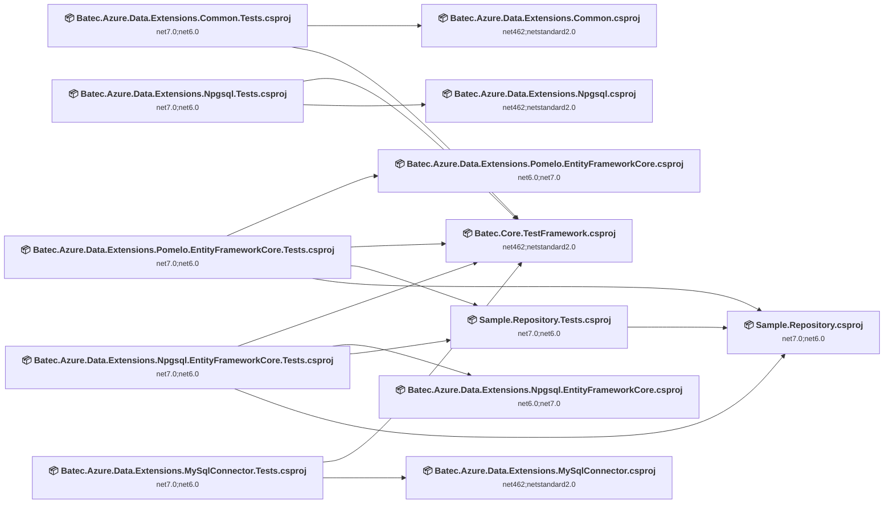

## Project Details

### Batec.Azure.Data.Extensions.Common\src\Batec.Azure.Data.Extensions.Common.csproj

#### Project Info

- **Current Target Framework:** net462;netstandard2.0
- **Proposed Target Framework:** net462;netstandard2.0;net10.0
- **SDK-style**: True
- **Project Kind:** ClassLibrary
- **Dependencies**: 0
- **Dependants**: 1
- **Number of Files**: 1
- **Number of Files with Incidents**: 1
- **Lines of Code**: 83
- **Estimated LOC to modify**: 0+ (at least 0,0% of the project)

#### Dependency Graph

Legend:
📦 SDK-style project
⚙️ Classic project

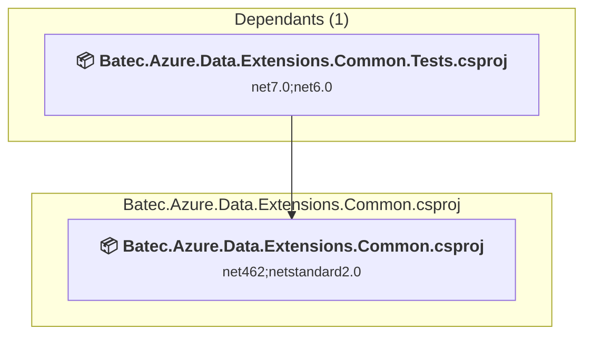

### API Compatibility

| Category | Count | Impact |
| :--- | :---: | :--- |
| 🔴 Binary Incompatible | 0 | High - Require code changes |
| 🟡 Source Incompatible | 0 | Medium - Needs re-compilation and potential conflicting API error fixing |
| 🔵 Behavioral change | 0 | Low - Behavioral changes that may require testing at runtime |
| ✅ Compatible | 58 |  |
| ***Total APIs Analyzed*** | ***58*** |  |

### Batec.Azure.Data.Extensions.Common\tests\Batec.Azure.Data.Extensions.Common.Tests.csproj

#### Project Info

- **Current Target Framework:** net7.0;net6.0
- **Proposed Target Framework:** net7.0;net6.0;net10.0
- **SDK-style**: True
- **Project Kind:** ClassLibrary
- **Dependencies**: 2
- **Dependants**: 0
- **Number of Files**: 2
- **Number of Files with Incidents**: 1
- **Lines of Code**: 48
- **Estimated LOC to modify**: 0+ (at least 0,0% of the project)

#### Dependency Graph

Legend:
📦 SDK-style project
⚙️ Classic project

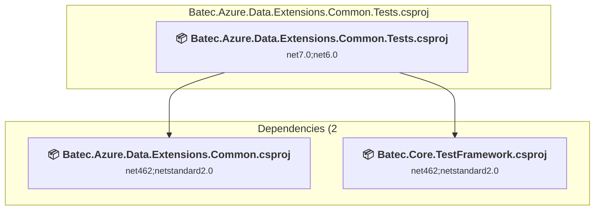

### API Compatibility

| Category | Count | Impact |
| :--- | :---: | :--- |
| 🔴 Binary Incompatible | 0 | High - Require code changes |
| 🟡 Source Incompatible | 0 | Medium - Needs re-compilation and potential conflicting API error fixing |
| 🔵 Behavioral change | 0 | Low - Behavioral changes that may require testing at runtime |
| ✅ Compatible | 13 |  |
| ***Total APIs Analyzed*** | ***13*** |  |

### Batec.Azure.Data.Extensions.MySqlConnector\src\Batec.Azure.Data.Extensions.MySqlConnector.csproj

#### Project Info

- **Current Target Framework:** net462;netstandard2.0
- **Proposed Target Framework:** net462;netstandard2.0;net10.0
- **SDK-style**: True
- **Project Kind:** ClassLibrary
- **Dependencies**: 0
- **Dependants**: 1
- **Number of Files**: 2
- **Number of Files with Incidents**: 1
- **Lines of Code**: 132
- **Estimated LOC to modify**: 0+ (at least 0,0% of the project)

#### Dependency Graph

Legend:
📦 SDK-style project
⚙️ Classic project

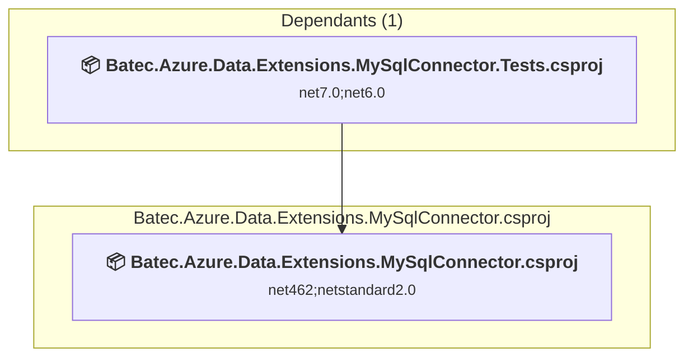

### API Compatibility

| Category | Count | Impact |
| :--- | :---: | :--- |
| 🔴 Binary Incompatible | 0 | High - Require code changes |
| 🟡 Source Incompatible | 0 | Medium - Needs re-compilation and potential conflicting API error fixing |
| 🔵 Behavioral change | 0 | Low - Behavioral changes that may require testing at runtime |
| ✅ Compatible | 70 |  |
| ***Total APIs Analyzed*** | ***70*** |  |

### Batec.Azure.Data.Extensions.MySqlConnector\tests\Batec.Azure.Data.Extensions.MySqlConnector.Tests.csproj

#### Project Info

- **Current Target Framework:** net7.0;net6.0
- **Proposed Target Framework:** net7.0;net6.0;net10.0
- **SDK-style**: True
- **Project Kind:** ClassLibrary
- **Dependencies**: 2
- **Dependants**: 0
- **Number of Files**: 2
- **Number of Files with Incidents**: 1
- **Lines of Code**: 64
- **Estimated LOC to modify**: 0+ (at least 0,0% of the project)

#### Dependency Graph

Legend:
📦 SDK-style project
⚙️ Classic project

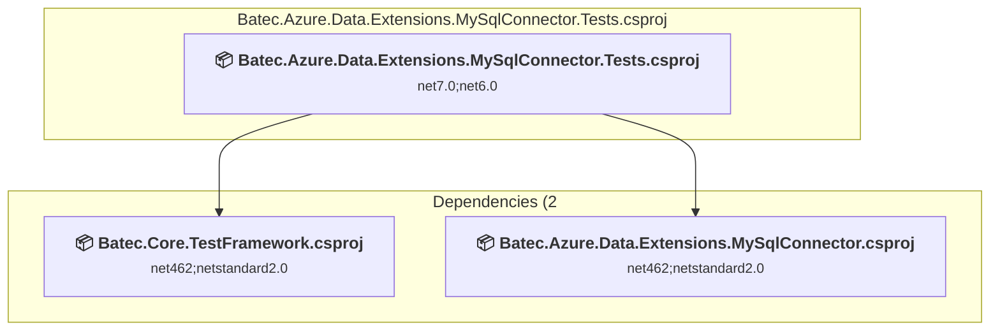

### API Compatibility

| Category | Count | Impact |
| :--- | :---: | :--- |
| 🔴 Binary Incompatible | 0 | High - Require code changes |
| 🟡 Source Incompatible | 0 | Medium - Needs re-compilation and potential conflicting API error fixing |
| 🔵 Behavioral change | 0 | Low - Behavioral changes that may require testing at runtime |
| ✅ Compatible | 19 |  |
| ***Total APIs Analyzed*** | ***19*** |  |

### Batec.Azure.Data.Extensions.Npgsql.EntityFrameworkCore\src\Batec.Azure.Data.Extensions.Npgsql.EntityFrameworkCore.csproj

#### Project Info

- **Current Target Framework:** net6.0;net7.0
- **Proposed Target Framework:** net6.0;net7.0;net10.0
- **SDK-style**: True
- **Project Kind:** ClassLibrary
- **Dependencies**: 0
- **Dependants**: 1
- **Number of Files**: 1
- **Number of Files with Incidents**: 1
- **Lines of Code**: 31
- **Estimated LOC to modify**: 0+ (at least 0,0% of the project)

#### Dependency Graph

Legend:
📦 SDK-style project
⚙️ Classic project

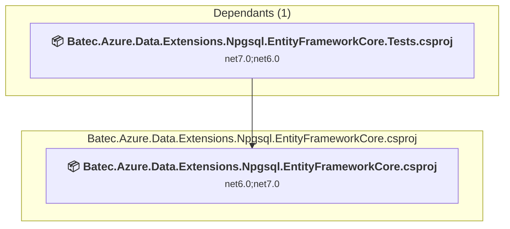

### API Compatibility

| Category | Count | Impact |
| :--- | :---: | :--- |
| 🔴 Binary Incompatible | 0 | High - Require code changes |
| 🟡 Source Incompatible | 0 | Medium - Needs re-compilation and potential conflicting API error fixing |
| 🔵 Behavioral change | 0 | Low - Behavioral changes that may require testing at runtime |
| ✅ Compatible | 11 |  |
| ***Total APIs Analyzed*** | ***11*** |  |

### Batec.Azure.Data.Extensions.Npgsql.EntityFrameworkCore\tests\Batec.Azure.Data.Extensions.Npgsql.EntityFrameworkCore.Tests.csproj

#### Project Info

- **Current Target Framework:** net7.0;net6.0
- **Proposed Target Framework:** net7.0;net6.0;net10.0
- **SDK-style**: True
- **Project Kind:** ClassLibrary
- **Dependencies**: 4
- **Dependants**: 0
- **Number of Files**: 7
- **Number of Files with Incidents**: 1
- **Lines of Code**: 343
- **Estimated LOC to modify**: 0+ (at least 0,0% of the project)

#### Dependency Graph

Legend:
📦 SDK-style project
⚙️ Classic project

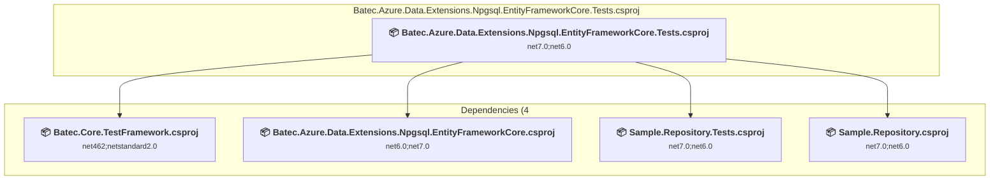

### API Compatibility

| Category | Count | Impact |
| :--- | :---: | :--- |
| 🔴 Binary Incompatible | 0 | High - Require code changes |
| 🟡 Source Incompatible | 0 | Medium - Needs re-compilation and potential conflicting API error fixing |
| 🔵 Behavioral change | 0 | Low - Behavioral changes that may require testing at runtime |
| ✅ Compatible | 335 |  |
| ***Total APIs Analyzed*** | ***335*** |  |

### Batec.Azure.Data.Extensions.Npgsql\src\Batec.Azure.Data.Extensions.Npgsql.csproj

#### Project Info

- **Current Target Framework:** net462;netstandard2.0
- **Proposed Target Framework:** net462;netstandard2.0;net10.0
- **SDK-style**: True
- **Project Kind:** ClassLibrary
- **Dependencies**: 0
- **Dependants**: 1
- **Number of Files**: 3
- **Number of Files with Incidents**: 2
- **Lines of Code**: 173
- **Estimated LOC to modify**: 2+ (at least 1,2% of the project)

#### Dependency Graph

Legend:
📦 SDK-style project
⚙️ Classic project

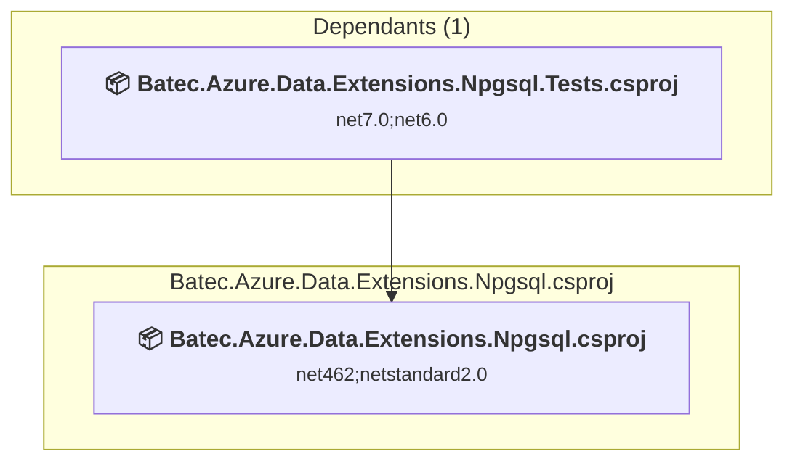

### API Compatibility

| Category | Count | Impact |
| :--- | :---: | :--- |
| 🔴 Binary Incompatible | 0 | High - Require code changes |
| 🟡 Source Incompatible | 2 | Medium - Needs re-compilation and potential conflicting API error fixing |
| 🔵 Behavioral change | 0 | Low - Behavioral changes that may require testing at runtime |
| ✅ Compatible | 90 |  |
| ***Total APIs Analyzed*** | ***92*** |  |

### Batec.Azure.Data.Extensions.Npgsql\tests\Batec.Azure.Data.Extensions.Npgsql.Tests.csproj

#### Project Info

- **Current Target Framework:** net7.0;net6.0
- **Proposed Target Framework:** net7.0;net6.0;net10.0
- **SDK-style**: True
- **Project Kind:** ClassLibrary
- **Dependencies**: 2
- **Dependants**: 0
- **Number of Files**: 3
- **Number of Files with Incidents**: 2
- **Lines of Code**: 113
- **Estimated LOC to modify**: 2+ (at least 1,8% of the project)

#### Dependency Graph

Legend:
📦 SDK-style project
⚙️ Classic project

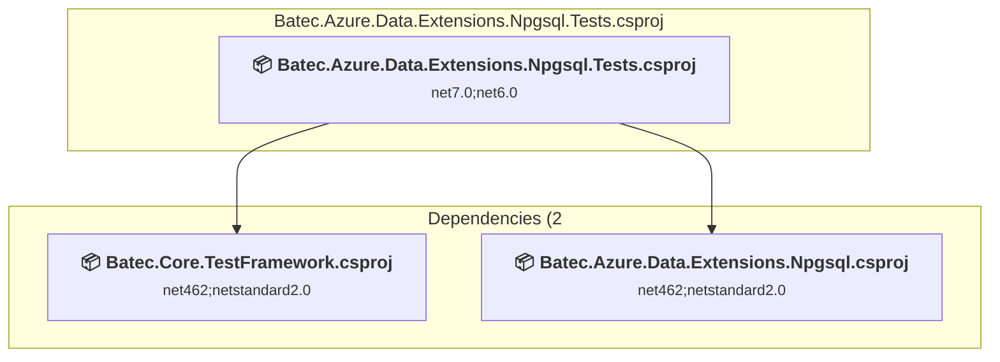

### API Compatibility

| Category | Count | Impact |
| :--- | :---: | :--- |
| 🔴 Binary Incompatible | 0 | High - Require code changes |
| 🟡 Source Incompatible | 2 | Medium - Needs re-compilation and potential conflicting API error fixing |
| 🔵 Behavioral change | 0 | Low - Behavioral changes that may require testing at runtime |
| ✅ Compatible | 79 |  |
| ***Total APIs Analyzed*** | ***81*** |  |

### Batec.Azure.Data.Extensions.Pomelo.EntityFrameworkCore\src\Batec.Azure.Data.Extensions.Pomelo.EntityFrameworkCore.csproj

#### Project Info

- **Current Target Framework:** net6.0;net7.0
- **Proposed Target Framework:** net6.0;net7.0;net10.0
- **SDK-style**: True
- **Project Kind:** ClassLibrary
- **Dependencies**: 0
- **Dependants**: 1
- **Number of Files**: 2
- **Number of Files with Incidents**: 1
- **Lines of Code**: 84
- **Estimated LOC to modify**: 0+ (at least 0,0% of the project)

#### Dependency Graph

Legend:
📦 SDK-style project
⚙️ Classic project

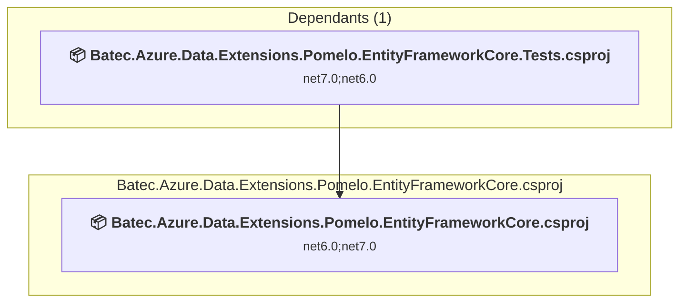

### API Compatibility

| Category | Count | Impact |
| :--- | :---: | :--- |
| 🔴 Binary Incompatible | 0 | High - Require code changes |
| 🟡 Source Incompatible | 0 | Medium - Needs re-compilation and potential conflicting API error fixing |
| 🔵 Behavioral change | 0 | Low - Behavioral changes that may require testing at runtime |
| ✅ Compatible | 9 |  |
| ***Total APIs Analyzed*** | ***9*** |  |

### Batec.Azure.Data.Extensions.Pomelo.EntityFrameworkCore\tests\Batec.Azure.Data.Extensions.Pomelo.EntityFrameworkCore.Tests.csproj

#### Project Info

- **Current Target Framework:** net7.0;net6.0
- **Proposed Target Framework:** net7.0;net6.0;net10.0
- **SDK-style**: True
- **Project Kind:** ClassLibrary
- **Dependencies**: 4
- **Dependants**: 0
- **Number of Files**: 7
- **Number of Files with Incidents**: 1
- **Lines of Code**: 340
- **Estimated LOC to modify**: 0+ (at least 0,0% of the project)

#### Dependency Graph

Legend:
📦 SDK-style project
⚙️ Classic project

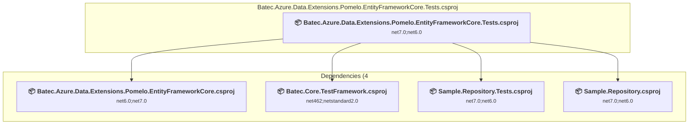

### API Compatibility

| Category | Count | Impact |
| :--- | :---: | :--- |
| 🔴 Binary Incompatible | 0 | High - Require code changes |
| 🟡 Source Incompatible | 0 | Medium - Needs re-compilation and potential conflicting API error fixing |
| 🔵 Behavioral change | 0 | Low - Behavioral changes that may require testing at runtime |
| ✅ Compatible | 279 |  |
| ***Total APIs Analyzed*** | ***279*** |  |

### Batec.Core.TestFramework\Batec.Core.TestFramework.csproj

#### Project Info

- **Current Target Framework:** net462;netstandard2.0
- **Proposed Target Framework:** net462;netstandard2.0;net10.0
- **SDK-style**: True
- **Project Kind:** ClassLibrary
- **Dependencies**: 0
- **Dependants**: 5
- **Number of Files**: 2
- **Number of Files with Incidents**: 1
- **Lines of Code**: 82
- **Estimated LOC to modify**: 0+ (at least 0,0% of the project)

#### Dependency Graph

Legend:
📦 SDK-style project
⚙️ Classic project

```mermaid
flowchart TB
    subgraph upstream["Dependants (5)"]
        P3["<b>📦&nbsp;Batec.Azure.Data.Extensions.Common.Tests.csproj</b><br/><small>net7.0;net6.0</small>"]
        P5["<b>📦&nbsp;Batec.Azure.Data.Extensions.Npgsql.Tests.csproj</b><br/><small>net7.0;net6.0</small>"]
        P7["<b>📦&nbsp;Batec.Azure.Data.Extensions.Pomelo.EntityFrameworkCore.Tests.csproj</b><br/><small>net7.0;net6.0</small>"]
        P9["<b>📦&nbsp;Batec.Azure.Data.Extensions.Npgsql.EntityFrameworkCore.Tests.csproj</b><br/><small>net7.0;net6.0</small>"]
        P12["<b>📦&nbsp;Batec.Azure.Data.Extensions.MySqlConnector.Tests.csproj</b><br/><small>net7.0;net6.0</small>"]
        click P3 "#batecazuredataextensionscommontestsbatecazuredataextensionscommontestscsproj"
        click P5 "#batecazuredataextensionsnpgsqltestsbatecazuredataextensionsnpgsqltestscsproj"
        click P7 "#batecazuredataextensionspomeloentityframeworkcoretestsbatecazuredataextensionspomeloentityframeworkcoretestscsproj"
        click P9 "#batecazuredataextensionsnpgsqlentityframeworkcoretestsbatecazuredataextensionsnpgsqlentityframeworkcoretestscsproj"
        click P12 "#batecazuredataextensionsmysqlconnectortestsbatecazuredataextensionsmysqlconnectortestscsproj"
    end
    subgraph current["Batec.Core.TestFramework.csproj"]
        MAIN["<b>📦&nbsp;Batec.Core.TestFramework.csproj</b><br/><small>net462;netstandard2.0</small>"]
        click MAIN "#bateccoretestframeworkbateccoretestframeworkcsproj"
    end
    P3 --> MAIN
    P5 --> MAIN
    P7 --> MAIN
    P9 --> MAIN
    P12 --> MAIN

```

### API Compatibility

| Category | Count | Impact |
| :--- | :---: | :--- |
| 🔴 Binary Incompatible | 0 | High - Require code changes |
| 🟡 Source Incompatible | 0 | Medium - Needs re-compilation and potential conflicting API error fixing |
| 🔵 Behavioral change | 0 | Low - Behavioral changes that may require testing at runtime |
| ✅ Compatible | 29 |  |
| ***Total APIs Analyzed*** | ***29*** |  |

### Sample.Repository.Tests\Sample.Repository.Tests.csproj

#### Project Info

- **Current Target Framework:** net7.0;net6.0
- **Proposed Target Framework:** net7.0;net6.0;net10.0
- **SDK-style**: True
- **Project Kind:** ClassLibrary
- **Dependencies**: 1
- **Dependants**: 2
- **Number of Files**: 2
- **Number of Files with Incidents**: 1
- **Lines of Code**: 34
- **Estimated LOC to modify**: 0+ (at least 0,0% of the project)

#### Dependency Graph

Legend:
📦 SDK-style project
⚙️ Classic project

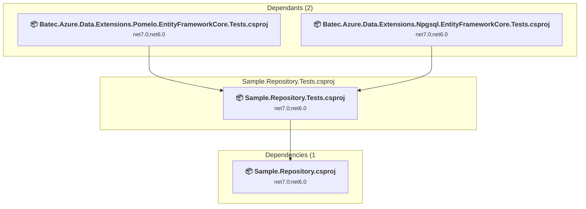

### API Compatibility

| Category | Count | Impact |
| :--- | :---: | :--- |
| 🔴 Binary Incompatible | 0 | High - Require code changes |
| 🟡 Source Incompatible | 0 | Medium - Needs re-compilation and potential conflicting API error fixing |
| 🔵 Behavioral change | 0 | Low - Behavioral changes that may require testing at runtime |
| ✅ Compatible | 29 |  |
| ***Total APIs Analyzed*** | ***29*** |  |

### Sample.Repository\Sample.Repository.csproj

#### Project Info

- **Current Target Framework:** net7.0;net6.0
- **Proposed Target Framework:** net7.0;net6.0;net10.0
- **SDK-style**: True
- **Project Kind:** ClassLibrary
- **Dependencies**: 0
- **Dependants**: 3
- **Number of Files**: 4
- **Number of Files with Incidents**: 1
- **Lines of Code**: 126
- **Estimated LOC to modify**: 0+ (at least 0,0% of the project)

#### Dependency Graph

Legend:
📦 SDK-style project
⚙️ Classic project

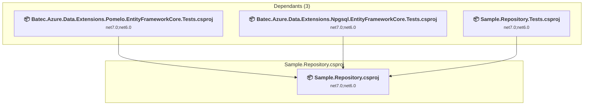

### API Compatibility

| Category | Count | Impact |
| :--- | :---: | :--- |
| 🔴 Binary Incompatible | 0 | High - Require code changes |
| 🟡 Source Incompatible | 0 | Medium - Needs re-compilation and potential conflicting API error fixing |
| 🔵 Behavioral change | 0 | Low - Behavioral changes that may require testing at runtime |
| ✅ Compatible | 139 |  |
| ***Total APIs Analyzed*** | ***139*** |  |

